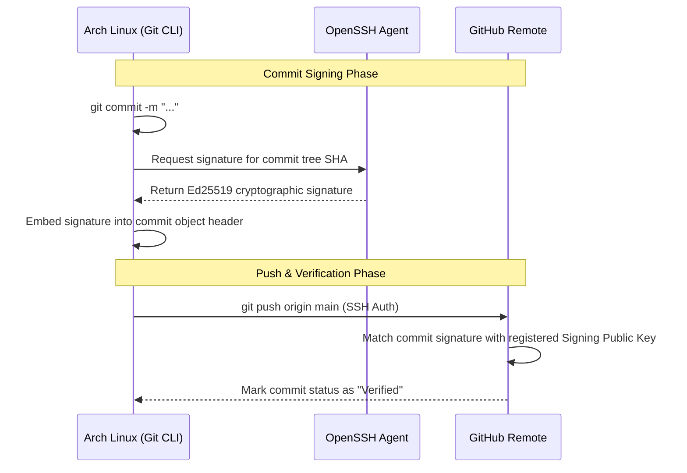

## 1. Technical Motivation: Ed25519 SSH vs GPG

Traditionally, Git uses GPG (GNU Privacy Guard) to sign commits. However, GPG has a complex setup, large keyring dependencies, and slow execution.

Starting from Git 2.34 and OpenSSH 8.0, Git natively supports signing commits using SSH keys.

- **Unified Infrastructure:** Use a single SSH key pair (Ed25519) for both repository authentication (Push/Pull) and cryptographic commit signing.
- **Performance & Security:** Ed25519 (Elliptic Curve Cryptography) offers fast signature generation, a compact key size (68 bytes), and security equivalent to RSA 3072-bit.
- **Zero Extra Tooling:** No need to install or maintain the heavy GPG suite and `gpg-agent`.

---

## 2. Generating an Ed25519 SSH Key

Open your terminal and generate a new key pair using the `ed25519` algorithm:

```bash
ssh-keygen -t ed25519 -C "your-email@domain.com"
```

1. **File location:** Press `Enter` to accept the default path `~/.ssh/id_ed25519`.
2. **Passphrase:** Enter a strong passphrase to protect your private key on your development machine.

Verify the generated key pair:

```bash
ls -la ~/.ssh/id_ed25519*
# Output:
# ~/.ssh/id_ed25519     (Private Key - Keep secret, permission 600)
# ~/.ssh/id_ed25519.pub (Public Key  - Safe to share)
```

---

## 3. Managing the SSH Agent

To avoid typing your passphrase for every Git command, load the key into `ssh-agent`.

### Option A: Use systemd User Service (Arch Linux Standard)

Arch Linux natively supports managing `ssh-agent` as a systemd user service:

```bash
systemctl --user enable --now ssh-agent
```

Add the environment variable to your `~/.zshrc` or `~/.bashrc`:

```bash
export SSH_AUTH_SOCK="$XDG_RUNTIME_DIR/ssh-agent.socket"
```

### Option B: Auto-start in Shell Config

Alternatively, add this check directly to your `~/.zshrc` or `~/.bashrc`:

```bash
if [ -z "$SSH_AUTH_SOCK" ]; then
   eval "$(ssh-agent -s)" > /dev/null
fi
```

Add your private key to the running agent:

```bash
ssh-add ~/.ssh/id_ed25519
```

---

## 4. Registering Public Keys on GitHub

Print your public key and copy it:

```bash
cat ~/.ssh/id_ed25519.pub
```

Go to **GitHub Settings -> SSH and GPG keys** and register two entries:

1. **Add Authentication Key:**
   - Click **New SSH key**.
   - Title: `Arch Linux - Auth`.
   - Key type: `Authentication Key`.
   - Paste the public key content and save.
2. **Add Signing Key:**
   - Click **New SSH key**.
   - Title: `Arch Linux - Signing`.
   - Key type: `Signing Key`.
   - Paste the same public key content and save.

---

## 5. Configuring Git for Global SSH Signing

Configure Git to use SSH for signing and automatically sign all future commits:

```bash
# 1. Author information
git config --global user.name "Your Name"
git config --global user.email "your-email@domain.com"

# 2. Set signing format to SSH
git config --global gpg.format ssh

# 3. Point signingkey to your public key file
git config --global user.signingkey ~/.ssh/id_ed25519.pub

# 4. Automatically sign all commits
git config --global commit.gpgsign true

# 5. Automatically sign all tags
git config --global tag.gpgsign true
```

Your resulting `~/.gitconfig` will look like this:

```ini
[user]
    name = Your Name
    email = your-email@domain.com
    signingkey = /home/username/.ssh/id_ed25519.pub
[gpg]
    format = ssh
[commit]
    gpgsign = true
[tag]
    gpgsign = true
```

---

## 6. Verification & Testing

### A. Test GitHub SSH Connection

```bash
ssh -T git@github.com
# Expected output:
# Hi username! You've successfully authenticated, but GitHub does not provide shell access.
```

### B. Test Signed Commit

Create an empty commit in any Git repository:

```bash
git commit --allow-empty -m "chore: verify ssh commit signing"
```

Verify the cryptographic signature on the commit log:

```bash
git log -1 --show-signature
```

Valid verification output:

```text
commit 7f2a1b... (HEAD -> main)
Good "git" signature for your-email@domain.com with ED25519 key SHA256:...
Author: Your Name <your-email@domain.com>
Date:   Wed Jan 28 10:00:00 2026 +0700

    chore: verify ssh commit signing
```

When you push this commit to GitHub, it will display the green **Verified** badge.

---

## 7. Architecture Sequence Flow


